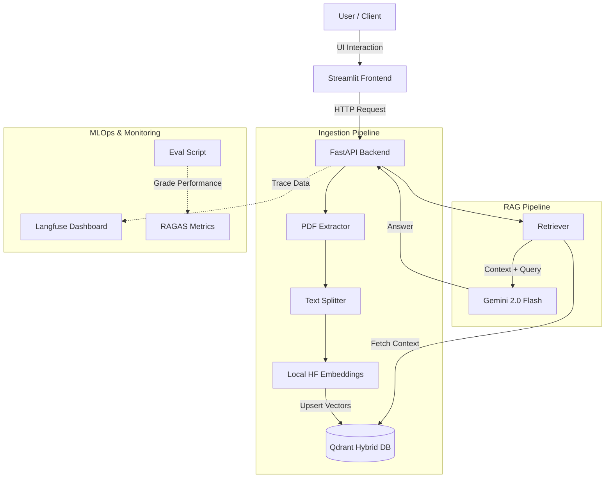

# 🚀 Production RAG Blueprint

> **An Enterprise-Grade GenAI Architecture: Scalable RAG Pipeline featuring Hybrid Vector Search, Full-Stack MLOps Observability, and Automated Evaluation Loops.**


## 📖 Overview

**Production RAG Blueprint** goes beyond standard RAG tutorials by implementing **MLOps best practices** for production environments. It addresses critical challenges in Generative AI such as **hallucination monitoring**, **retrieval accuracy**, and **deployment scalability**.

Engineered to be modular, it allows users to upload complex PDF documents, automatically index them into a hybrid vector store, and perform intelligent Q&A using **Google Gemini 2.0 Flash** with strictly grounded responses.

### 🌟 Key Features

*   **🏗 Hybrid Vector Database Architecture**: Smart routing that switches between **Qdrant Local** (for fast development) and **Qdrant Cloud** (for scalable production) based on environment context.
*   **👁️ Full Observability**: Deep integration with **Langfuse** to trace every request chain, monitor latency, track token usage, and debug retrieval steps in real-time.
*   **📉 Cost-Efficient Embedding**: Utilizes optimized local **HuggingFace Embeddings** (`all-MiniLM-L6-v2`) running on CPU to eliminate embedding API costs and rate limits.
*   **🤖 Automated Evaluation Pipeline**: Includes a built-in **RAGAS** script to grade the bot's "Faithfulness" and "Relevancy" using an LLM-as-a-Judge approach.
*   **🖥️ Chat Interface**: Includes a **Streamlit** frontend for an interactive chat experience and easy document management.
*   **🚀 CI/CD Automation**: Robust **GitHub Actions** workflows that run unit tests and dependency checks on every push.
*   **🐳 Containerized Deployment**: Fully Dockerized and deployed live on **Hugging Face Spaces**.

---

## 📂 Project Structure

The project follows a **Modular Monolith** architecture to ensure maintainability and scalability.

```text
production-rag-blueprint/
├── .github/workflows/   # CI/CD Pipelines (GitHub Actions)
├── app/
│   ├── core/            # Configuration & Database connections
│   ├── evaluation/      # RAGAS Evaluation Logic & Manager
│   ├── ingestion/       # ETL Pipeline (Extractor -> Chunker -> Embedder)
│   ├── monitoring/      # Structured Logging (Loguru) configuration
│   ├── rag/             # Core RAG Logic (Retriever + LLM Chain)
│   ├── routers/         # FastAPI Routes (Endpoints)
│   └── main.py          # Application Entry Point
├── docker/              # Docker Compose orchestration files
├── frontend/            # Streamlit User Interface
├── scripts/             # Utility scripts (e.g., run_eval.py)
├── tests/               # Unit tests (Pytest)
├── .env.example         # Environment variables template
├── Dockerfile           # Production Docker build instruction
└── requirements.txt     # Project dependencies
```

---

## 🛠 Tech Stack

| Component | Technology | Description |
| :--- | :--- | :--- |
| **Backend** | **FastAPI** | High-performance, async-ready API framework. |
| **Frontend** | **Streamlit** | Interactive UI for chat and file management. |
| **LLM Engine** | **Google Gemini 2.0 Flash** | SOTA model for fast and accurate generation. |
| **Vector DB** | **Qdrant** | Hybrid setup (Local Disk / Cloud Cluster). |
| **Orchestration** | **LangChain** | Advanced chaining for retrieval and generation. |
| **Observability** | **Langfuse** | End-to-end tracing and monitoring. |
| **Evaluation** | **RAGAS** | Automated metrics calculation (Faithfulness/Relevancy). |
| **DevOps** | **Docker & GitHub Actions** | Containerization and Continuous Integration. |

---

## 🏗 Architecture



---

## 🚀 Live Demo

*   **💻 Frontend UI (Streamlit)**: [Chat Interface Demo](https://production-rag-blueprint.streamlit.app)
*   **⚙️ Backend API (Swagger)**: [API Documentation](https://bestoism-rag-insight-pipeline.hf.space/docs)

---

## ⚡ Installation & Local Setup

### 1. Clone the Repository
```bash
git clone https://github.com/bestoism/production-rag-blueprint.git
cd production-rag-blueprint
```

### 2. Set up Virtual Environment
```bash
python -m venv venv
# Windows
venv\Scripts\activate
# Mac/Linux
source venv/bin/activate
```

### 3. Install Dependencies
```bash
pip install -r requirements.txt
```

### 4. Configure Environment Variables
Create a `.env` file in the root directory (copy from `.env.example`):
```ini
# Project Settings
PROJECT_NAME="Production RAG Blueprint"
API_V1_STR="/api/v1"

# LLM Provider (Google Gemini)
GOOGLE_API_KEY=your_google_api_key

# Vector Database (Hybrid Config)
# Leave URL empty for Local Mode. For Cloud, fill in the details:
QDRANT_URL=
QDRANT_API_KEY=

# Observability (Langfuse)
LANGFUSE_SECRET_KEY=sk-lf-...
LANGFUSE_PUBLIC_KEY=pk-lf-...
LANGFUSE_HOST=https://cloud.langfuse.com
```

### 5. Run the Application
You can run the Backend and Frontend separately.

**Option A: Run Backend API**
```bash
uvicorn app.main:app --reload
```
*Access API Docs at `http://localhost:8000/docs`*

**Option B: Run Frontend UI**
```bash
streamlit run frontend/app.py
```
*Access Chat Interface at `http://localhost:8501`*

---

## 🧪 Evaluation & Testing

### Running Unit Tests (CI/CD)
We use `pytest` to ensure API health and configuration integrity.
```bash
pytest tests/
```

### Running RAGAS Evaluation
To evaluate the RAG pipeline's accuracy using an automated Judge:
```bash
python scripts/run_eval.py
```

---

## 🐳 Docker & Deployment

The application is containerized using Docker and optimized for Hugging Face Spaces (Port 7860).

### Local Orchestration (Docker Compose)
To run both the API and a local Qdrant instance instantly:
```bash
cd docker
docker-compose up
```

---

**Developed by [Bestoism]**
